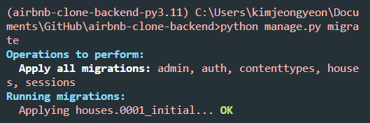

# airbnb-clone-backend

<details>
<summary> #3.0 Run Server (04:57)
</summary>

**서버 키는 법**

airbnb-clone-backend 폴더 위치 아래에서 터미널을 킨 후 `poetry shell`로 `django` 가상환경으로 들어가준다.
그 다음 `python manage.py runserver` 명령어를 터미널에서 실행해준다.

**서버 닫는 법**

`Ctrl + C`로 중지한다.

</details>

<details>
<summary>
#3.1 Migrations (07:16)
</summary>

**admin page**

/admin/ 페이지로 가려함.

- /admin/ 페이지가 접속이 안되는 경우
  DB에 django_session 이라는 테이블이 없기 때문이다.

서버를 열면서 생긴 'db.sqlite3' 폴더는 DB파일인데 비어있다.

- migration 작업을 통해 문제 해결
  migration은 DB의 state를 수정하는 작업을 의미한다.

  

  18개의 migration이 있다.

  `python manage.py migrate` 명령어를 터미널에 실행시켜 문제를 해결한다.

  

- /admin/ 페이지 로그인 시 로그인 오류화면을 볼 수 있음


</details>

<details>
<summary>
#3.2 Recap (04:57)
</summary>

**migration**

migration 파일에는 DB를 변화시킬 수 있는 python 코드가 들어있다.

이중에는 `auth-user`파일이 있을 것이다. 유저 저장 테이블이다.

</details>

<details>
<summary>
#3.3 Super User (07:24)
</summary>

**관리자 페이지**

터미널을 하나 더 열고 `django` 가상환경으로 들어가준 뒤 `python manage.py createsuperuser`를 실행한다.

비밀번호 설정 시 유효성 검사를 자동으로 해줌을 볼 수 있다.


`/admin/`으로 들어가 설정한 아이디 비번을 입력하면 관리자 페이지를 볼 수 있다.


관리자 페이지에서 본인 계정의 비밀번호 변경, 다른 유저의 비밀번호 변경, 유저생성, 그룹생성 등의 작업을 할 수 있다.

</details>

<details>
<summary>
#3.4 Framework vs Library (10:35)
</summary>

**라이브러리와 프레임워크의 차이 설명**

우리가 import를 통해 `라이브러리`를 호출한다.

`프레임워크`는 우리가 쓴 코드를 호출한다.

config폴더의 `setting.py` 파일의 내용을 수정함으로써 사용자의 코드에 맞춰 웹페이지의 내용이 바뀌는 것을 볼 수 있다.


(프레임워크의 특징이다)

</details>

<details>
<summary>
#3.5 Apps (07:14)
</summary>

**장고의 프로젝트는 application들로 이루어져 있다**

Airbnb를 예시로 든다.

(`room`)숙소 정보와 (`user`)숙소 주인정보나 고객정보를 위한 로직을 같은 파일에 두지 않고 따로 둘 것이다.

`room`을 업로드하고 수정하고 삭제하는 등의 로직과 정보를 DB에 저장하고 변경사항을 적용해야한다.

`user`들이 소통하고 본인의 숙소페이지를 관리하고 본인의 예약정보를 관리하고, DB에 정보를 저장하고 변경사항을 적용해야한다.

</details>

<details>
<summary>
#4.0 Models (10:43)
</summary>

**장고의 프로젝트는 application들로 이루어져 있다**

django가상환경에서 다음 명령어를 터미널에 입력한다.
`python manage.py startapp 어플리케이션_이름`

'어플리케이션\_이름'에 해당하는 폴더가 만들어진다.

house 어플리케이션에 대한 데이터의 detail을 `models.py`에 작성한다.

파일을 수정하고 저장하여도 자동으로 서버가 재시작 되지 않는데 django가 아직 house 어플리케이션에 대해 모르기 때문이다.

config폴더의 `setting.py`파일에 `INSTALLED_APPS`에 우리가 만든 어플리케이션을 추가한다.


`"houses.apps.HousesConfig"` 추가하기

</details>

<details>
<summary>
#4.1 Migrations (11:55)
</summary>

**Migrations**

django는 자동으로 admin 패널을 우리의 데이터로 생성해준다.

house폴더 아래에 있는 `admin.py`파일에 다음코드를 추가해준다.

```python
@admin.register(House)
class HouseAdmin(admin.ModelAdmin):
    pass
```

House라는 모델을 추가해주는 것을 볼 수 있다.


하지만 눌러보면 table이 없다는 오류가 뜬다.

직접 migration을 함으로써 table을 만들어 줄 수 있다.

새로운 터미널을 열고 django가상환경상태에 진입한 후, `python manage.py makemigrations` 명령어를 입력한다.


house 폴더 아래에 migration 폴더가 생겼고, 그 안에 '0001_initial.py'파일이 생겼다.


변경된 데이터베이스를 적용하기 위해 `python manage.py migrate` 명령어를 입력해준다.



그러면 이제 Houses를 눌렀을 때 migrate한 데이터베이스가 보인다.


'ADD HOUSE' 버튼을 눌러 예전에 미리 설정해두었던 db자료형에 맞춰 내용을 추가할 수 있다.


Houses에 내용물을 하나 추가하고 서버를 껐다키면 전에 추가했었던 내용이 살아있는 것을 확인할 수 있다.


</details>

<details>
<summary>#4.2 Recap (10:49)</summary>

기존에 설치된 앱과 새로만들어 추가한 앱을 분리하여 따로 합쳐준다.

`INSTALLED_APPS = SYSTEM_APPS + CUSTOM_APPS`

migration을 테스트해보기위해 house폴더 아래에 있는 `models.py`에서 'price'를 'price_per_night'로 바꾼 후 변경사항을 적용시키기 위해 migration을 해준다.


migration폴더 아래에 새로운 파이썬 파일이 생기고 변경사항이 기록된다.


변경사항을 `python manage.py makemigrations`로 등록해주고, `python manage.py migrate`로 적용해준다.


적용된 모습이다.

</details>

<details>
<summary>#4.3 Admin (13:08)</summary>

**admin 패널 추가설정하기**

admin패널에 들어가면 Houses 클래스로부터 만들어진 항목의 이름이 'House object(1)' 로 보인다.

model.py에서 House클래스에 `__str__()` 메소드를 수정해줌으로써 우리가 원하는 형태로 보이게 할 수 있다.

```
    def __str__(self):
        return self.name
```

admin.py에서 `list_display=[]`에 데이터 속성이름을 적어주면 해당 속성들을 미리보기 가능하다.

```
    list_display = [
        "name",
        "price_per_night",
        "address",
        "pets_allowed",
    ]
```

`list_filter=[]`를 추가해주면 오른쪽에 필터목록을 볼 수 있다.


```
    list_filter = [
        "price_per_night",
        "pets_allowed",
    ]
```

`    search_fields = ["address"]`이 코드를 추가 함으로써 주소를 기준으로 검색할 수 있는 검색창이 생긴다.

`"address_startwith"`를 집어넣으면 검색키워드로 시작하는 것만 뜨고, 그냥 `"address"`만 넣으면 키워드가 중간에 들어있어도 모두 검색된다.

</details>

<details>
<summary>#4.4 Documentation (13:33)</summary>

**Documentation**

[장고문서](https://docs.djangoproject.com/en/4.2/ref/models/fields/)

Documents를 통해 admin패널에서 도움말, 데이터 이름, 데이터 숨기기, 리스트상태에서 수정가능하게 하기 등등의 많은 기능을 적은 코드로 사용할 수 있다.

It's insane~

</details>

<details>
<summary>#5.0 Introduction (11:52)</summary>

**User Applications 환경설정\_0**

인터프리트 설정을 poetry환경으로 잡아준다.

그러면 django 임포트할때 밑에 경고물결줄이 안뜬다.

</details>

<details>
<summary>#5.1 Custom Model (13:53)</summary>

**User Applications 환경설정\_1**

[Documents Link](https://docs.djangoproject.com/en/4.2/topics/auth/customizing/#substituting-a-custom-user-model)

`python manage.py startapp users`로 새로운 커스텀 유저를 만들어준다.

기존 유저의 모든 것을 상속받아야함.

1.  `AbstractUser`의 모든 것을 상속받은 `User`를 커스터마이징하고,

2.  커스터마이징한 `User`를 Django에게 사용하겠다고 인지시켜야한다.

    2-1. 링크에서 추가해야하는 코드를 `setting.py`에 추가한다.

    2-2. user application을 설치해야하므로 `CUSTOM_APPS`에 추가해준다.

    2-3. 커스텀 USER를 만들었는데 이미 옛날에 만들어둔 USER와 충돌을 일으키기 때문에 서버를 끄고 DB를 삭제해준다. "db.sqlite3"을 삭제한다. 서버 재실행해준다.

    2-4. 그리고 houses에 있는 migrations 파일도 지워준다.(0001\_.... 이렇게 생긴 파일들). (폴더와 `__init__.py` 파일은 살려둠)

    2-5. `python manage.py makemigrations`를 해준다.

    

    2-6. `python manage.py migrate`로 새정보로 업데이트해주고, 동기화된다.

3.  user모델을 admin패널에 추가한다.

    3.1 users폴더에 admin.py에 내용을 추가해준다.

    3.2 다시 페이지를 리로드하면 로그인을 다시해야하는데, DB를 지웠기 때문에 세션이 종료된 것이고, user로 새로 생성해 줘야한다.

    따라서 `python manage.py createsuperuser`로 user계정을 새로 만들어준다.


유저가 분리되어 보인다. 이전에는 Groups와 같이 있었다.

</details>

<details>
<summary>#5.2 Custom Fields (06:23)</summary>

**Custom User Model**

파이썬 코드에 있는 모델 구조와 DB구조를 서로 동기화 하기 위해 추가작업(기본값 넣어주기 등의 작업)을 해줘야 한다.

만약 'is_host'필드에 기본값을 지정해주지 않고 `python manage.py makemigrations`를 해주면 동기화를 위한 오류를 발생시킬 것이다.


추가한 'is_host' 필드는 기본값없이 Nill 값으로 추가가 불가능하다는 오류이다.

옵션1. 일회성 기본값제공하기. 하지만 기존 행들의 이 열 값들이 모두 null값이 된다.

옵션2. 이 작업을 중지하고 models.py에서 기본값을 지정해준다.

2번을 선택하여 추가작업을 해줄 것이다.

</details>

<details>
<summary>#5.3 Defaults (11:04)</summary>

**Adding Default**

DB를 수정하여 기존에 있었던 필드가 사라지면 원래 있어야 할 것이 없어져서 오류가 발생한다.

default 값이 필요한 필드에 default값을 넣어주고 makemigrations를 해준다.

웹에서 유저를 클릭하여 들어가보자.

하지만 필드가 non-editable 상태여서 오류가 발생하는 것을 볼 수 있다.

다음 강의에서 해결한다.

</details>

<details>
<summary>#5.4 Custom Admin (08:34)</summary>

**Admin pages modify**

어드민 페이지를 수정하였다.

</details>
<details>
<summary>#5.5 Foreign Keys (13:16)</summary>

**유저 연동시키기(model연결시키기)**

ForeignKey를 사용하여 사용자를 연결한다.

만약 사용자가 지워지면 어떻게 처리할 것인지 정해주어야만 한다.

NULL로 처리해줄 수 있다. 하지만 그 유저가 만든 house가 주인이 없는 채로 남아있으면 안됨으로 house도 같이 delete해주기 위한 CASCADE를 쓴다. `on_delete=models.CASCADE`

그 다음 db.sqlite3과 migrations 폴더에 있는 파일들을 모두 지워준다.(`__init__.py` 빼고)

초기화 해주는 과정이다.

초기화가 되었기 때문에 makemigrations, migrate, createsuperuser를 다 해준다.(jeongyeon, 123)

웹페이지에 들어가서 house에 추가를 해주면 아래에 새로운 필드가 생긴 것을 확인할 수 있다.


박스를 클릭하면 사용자를 선택해줄 수 있다. 초기여서 '-----'와 'jeongyeon' 2개만 있다.

house가 user의 ForeignKey를 가지고 있다고 알려주었기 때문에 models를 연결할 수 있었다.

PositiveIntegerField를 사용하게되면 단순히 숫자를 저장하기만 한다. 하지만 ForeignKey를 사용하면 Django에게 참조하고 싶은 model을 알려줌으로써 연결을 해준다.

</details>

<details>
<summary>#5.6 Super Mega Recap (16:07)</summary>

**관계형DB를 Django에서 다루기**

사용자를 예시로 user테이블과 house테이블을 연결하였다.

만약 user테이블에있는 user가 하나 사라진다면, 그 user와 연관된 house를 어떻게 처리할 것인지가 문제가 된다.

house를 같이 삭제시키는 방법과 house의 user정보를 null로 만들어버리는 방법 2가지가 있다.

extensions에서 sqlite viewer를 설치하면 django의 sqlite db를 시각화해서 볼 수 있다.

다음에 model들을 생성할 것이기 때문에 house폴더를 삭제시켰다. 그리고 setting.py에서 custom_apps에 있는 house도 지워준다.

그다음 migration폴더에 있는 것도 지워서 초기화 해준다.

</details>
<details>
<summary>#6.0 User Model (11:38)</summary>

**최종 프로젝트에서 사용할 model만들기**

user 모델을 확장하였음

</details>
<details>
<summary>#6.1 Room Model (07:08)</summary>

**최종 프로젝트에서 사용할 model만들기**

rooms 모델을 새로 만들어줌

콘솔창에 `python manage.py startapp rooms`를 쳐서 새 모델을 만들어 주고, Config폴더에 있는 settings.py에 CUTSTOM_APPS에 `"rooms.apps.RoomsConfig",` 을 추가한다.

many-to-many 것들을 위해 나머지는 다음강의에

</details>
<details>
<summary>#6.2 Many to Many (13:19)</summary>

**최종 프로젝트에서 사용할 model만들기**

many to many 의 의미를 알기 위해서는 Many to one, One to many의 의미를 알아야 한다.

- room1, room2, room3 -> user1 (Many to one)

- user1 -> room1, room2, room3 (One to many)

Amenty model이 many to many relationship을 가진다.

Amenity1, Amenity2, Amenity3 => room1, room2, room3

그리고 반복을 피하기 위해서 생성된 날짜, 변경수정된 날짜를 저장하는 필드를 하나 만들어준다.

여기서 `auto_now_add=True`를 해주게 되는데 처음 생성되었을 때 날짜를 넣어주는 기능이다.

update는 `auto_now=True`를 넣어줘서 저장될 때마다 시간이 기록되게 한다.

근데 여기서 만들고 있는 시간 저장기능은 다른곳에서도 똑같이 사용될 것이다. 그러면 반복적으로 같은 코드를 사용해줘야하는데 이 중복되는 것을 막기 위해서 새로운 application을 만들어줄 것이다.

콘솔에 `python manage.py startapp common`으로 공통 코드를 위한 새 application을 만들어준다.

이 새로 만들어준 common모델에는 추상모델을 만들어준다. 이 모델은 db에 추가하지 않고 다른 모델에서 재사용하기 위한 모델이다. 이것은 blueprint같은 모델이다.

만들어준 common 모델에 아래부분에

```(python)
class Meta:
    abstract = True
```

을 적어준다면 django는 이 모델에 대해서 쓸모없는 db를 만들어내지 않는다.

사용하기 위해서는 사용하고자 하는 모델에 임포트를 먼저 한 후 `from common.models import CommonModel` 시작할 때 modles.Model부분을 `CommonModel` 로 바꿔적어주면 된다.

</details>
<details>
<summary>#6.3 Recap (08:00)</summary>

**최종 프로젝트에서 사용할 model만들기**

만든 rooms와 amenities를 웹상에서 확인해봄.

db에서 직접 확인해보면 생성날짜 수정날짜도 확인할 수 있다.

</details>
<details>
<summary>#6.4 Rooms Admin (12:49)</summary>

**최종 프로젝트에서 사용할 model만들기**

room과 amenity의 이름 수정

그리고 Amenity모델을 자동으로 복수형으로 표시하는 django의 기능 중 Amenitys라고 잘못된 복수형을 다음 코드로 바로잡아준다.

```(python)
class Meta:
    verbose_name_plural = "Amenities"
```

admin.py에서 목록에서 어떻게 보일지, 어떤 필터 적용기준으로 보여줄지 패널에서 시각화 할 수 있다.

</details>
<details>
<summary>#6.5 Experiences (12:27)</summary>

**최종 프로젝트에서 사용할 model만들기**
experience창 만들기

</details>

<details>
<summary>#6.6 Categories (11:02)</summary>

**최종 프로젝트에서 사용할 model만들기**
category 연결 만들기

</details>
<details>
<summary>#6.7 Reviews (08:28)</summary>

**최종 프로젝트에서 사용할 model만들기**
review 테이블만들기

</details>
<details>
<summary>#6.8 Wishlists (05:45)</summary>

**최종 프로젝트에서 사용할 model만들기**
wishlist 만들기

</details>

<details>
<summary>#6.9 Bookings (14:42)</summary>

**최종 프로젝트에서 사용할 model만들기**
booking 만들기

-> rooms, experiences 2개 모두 예약할 수 있는 booking기능을 만들 것이다. 2개중 선택을 할 수 있도록 choice클래스를 하나 만들어준다.

booking에서 check_in, check_out을 만들어 줄 때에는 DB에 시간을 포함하여 저장할 것인지 날짜만 저장할 것인지를 우리가 정하여 만들어줘야 한다.(여기서는 날짜만 저장하기로 함)

</details>
<details>
<summary>#6.10 Medias (10:11)</summary>

**최종 프로젝트에서 사용할 model만들기**
Media 만들기

OneToOneField를 만들었는데 고유한 것을 연결할 때 사용하였다.(드물게 사용함)

</details>

<details>
<summary>#6.11 Direct Messages (15:21)</summary>

**최종 프로젝트에서 사용할 model만들기**
direct_messages 만들기

dms로 이름지어도 되어서 그렇게 했음

application이름은 해당 모델의 폴더 아래에 app.py에서 name을 수정함으로서 바꿀 수 있다.

admin패널에서 추가적으로 문자 개수, 채팅방에 참여하고있는 사람수, 개시한 방에 평점 등의 추가적인 속성을 넣어줄 수 있을 것이다.

</details>
<details>
<summary>#7.0 Introduction (10:58)</summary>

**Django의 ORM**

콘솔창에서 shell로 db와 소통할 것이다.

`python manage.py shell`

models를 통해 db에 접근한다.

db에 있는 모든 room찾기

`from rooms.models import room`

`Room.objects.all()`

어떠한 속성으로도 찾을 수 있다.

`Room.objects.get(name="서울집")`

.get 뿐만아니라 .create, .filter도 있다

`room = Room.objects.get(name="서울집")`

처럼 변수에 저장하고

`room.created_at`,`room.name`,`room.id`등의 명령어를 입력할 수 있다.

`room.price = 2000`으로 하고 `room.save()`를 하게되면 db가 업데이트된다. 심지어 updated_at에 시간이 반영된다. 하지만 국제표준시간 기준이여서 9시간 느리게 보인다.

</details>

<details>
<summary>#7.1 filter, get, create, delete (14:10)</summary>

**ORM 용어들**

- `.get()` 특정한 object 하나만 찾고 싶을때

  `Room.objects.get(pk=1)` primary key 1로 찾을때

- `.filter()` 필터적용하여 가져오기

  - `Room.objects.filter(pet_friendly=True)`
    'pet_friendly'를 필터적용하여 가져오면 결과값 개수가 1개 이상이므로(0개가 나올 수 있음) `.filter()`를 사용해야한다. 만약 `.get()`을 사용하면 오류가 날 것이다.

  - filter는 유용하다. '속성'+ '\_\_필터값' 형식으로 underscore를 이용한다.

  - 부등호도 사용하다.

  `Room.objects.filter(price__gt=15)`

  - 검색어도 사용가능하다('seoul'이 들어간 방만 찾기 같은 행위)

    `Room.objects.filter(name__contains="서울")`

    `Room.objects.filter(name__startswith="서울")`

- `.all()` 모든것을 보여줌

- `.create()` db내용물 생성하기

  괄호안에 속성값을 잘 넣어줘야한다.

  `Amenity.objects.create(name="Amenity from the Console",  description="cool")`

- `.delete()` 선택한 db값을 삭제할 수 있다.

  `.get()`으로 삭제하고싶은 것을 고르고 삭제해준다.
  `Amenity.objects.get(pk=4).delete()`

      </details>

  <details>
  <summary>#7.2 QuerySets (07:01)</summary>

**QuerySets은 무엇인가**

연산자를 함께 묶어주는 역할을 한다.

filter 사용시 여러 속성을 ','로 묶어줄 수 있다.

db와 소통하지 않고 db에 있는 모든 데이터를 몽땅 꺼내온다.

QuerySet은 구체적으로 요청받을 때만 데이터를 제공할 것이다.

명령을 즉시 실행시켜주지 않고 데이터를 요청할 때만 제공한다.

1. 게으르기 때문에 db를 힘들게 하지 않는다.

2. 서로다른 QuerySet들을 연결할 수 있다.

all같은 db를 힘들게 할 수 있는 명령어를 실행한다면 db를 바로 다 보여주지 않고 QuerySet형태로 짧게 보여준다.

</details>

<details>
<summary>#7.3 Admin Methods (14:34)</summary>

**lookup 무엇인가**

"\_\_"연산자는 lookup연산자라고 부른다.

[Documentation link](https://docs.djangoproject.com/en/4.1/ref/models/querysets/#field-lookups)

QuerySet을 반환하는 메소드도 있고, 반환하지 않는 메소드도 있다.

새로운 db 콘솔 지식을 통하여 admin 패널에서 더 많은 것을 할 수 있다.

예를들면 .count()메소드를 통해 얼마나 많은 요소들이 있는지를 표시해줄 수 있다.

`"total_amenities",`이 항목을 rooms의 admin.py에 추가할 것이다. 하지만 이것은 미리 만들어주지 않았기 때문에 오류가 발생한다.(Room클래스의 메소드로 찾아내려 한다.)

2가지 방법이 있다.

1. 직접 model에 메소드를 추가하기. ORM을 이용하는 방법이다.

2. admin.py에 직접 메소드를 만들어주기. 메소드는 self뿐만 아니라 room도 매개변수로 갖게된다.

1번방법은 room에 항상 total_amenities메소드가 따라다닐 것이다. room을 쓸때마다 total_amenities도 필요하다면 1번방법이 좋다. 2번방법은 관리자 패널에서만 확인할 수 있다. 다른곳에서는 전혀 필요없고, 관리자 패널에만 필요하다면 2번방법이 좋을 수 있다.

```
#(admin.py)
def total_amenities(self, room):
    return room.amenities.count()
```

```
def total_amenities(self):
    return self.amenities.count()
```

이렇게 해줌으로서 count()메소드로 amenities개수를 표현해줄 수 있다.

</details>
<details>
<summary>#7.4 ForeignKey Filter (11:33)</summary>

**foreignKey로 필터링하기**

reverse accessors : 관계를 뒤집어서 접근하도록 하는 것.

사용하는 이용 : 반대방향으로 원하는 정보를 찾을 때

room 모델은 user모델을 foreignKey로 포인팅하고 있다.

reverse란 user를 가리키고 있는 model을 찾기 위한 것. 반대방향으로 원하는 것을 찾아가는 것.

예를 들어 room.owner은 room에서 user를 찾아내는 것이다. 근데 user에서 room을 찾아내는 방법, 이것이 reverse이다.

`Room.objects.filter(owner__username="jeongyeon")`

이런식으로 작성하면 해당 유저의 모든 room을 QuerySet으로 보여준다.

`Room.objects.filter(owner__username__startswith="j")`

이런것도 가능하다(~로 시작하는 것 찾기 필터)

이런 기능이 반복적으로 많이 필요한 경우가 있다. 예를들어 인스타그램에서 creater가 사진을 올리는 기능이 있고 그 creater를 클릭하여 그사람이 올린 사진들을 보는 행위 reverse가 있는데 둘다 반복적으로 많이 쓰이는 기능이 될 것이다.

room.owner.username은 가능하다. 방을 업로드한 유저의 이름을 보는 기능이다. 하지만 반대로 유저의 이름을 기준으로 그 유저가 올린 방을 모두 찾아보는 기능 user.rooms 이러한 기능은 만든적이 없다. reverse로 찾아야 하는 것이다. 하지만 코드를 손봐서 기능을 만들어 줄 수 있다.

</details>
<details>
<summary>#7.5 Reverse Accessors (11:27)</summary>

**Reverse Accessors**

콘솔에서 User를 임포트해와서 pk=1을 me라는 변수에 저장하자.

`dir(me)`를 통해 많은 메소드와 속성을 볼 수 있다.

`~_set`이라는 것이 많다. 이것이 reverse accessors이다.

`me.room_set.all()`을 입력하면 해당 유저의 모든 room을 보여준다.

새로운 유저를 만들어주자. (admin, adminpw1234) 방하나를 admin의 방으로 바꿔준다.

다시 명령어를 입력하면 방이 하나 없어져있다.

규칙 : ForeignKey는 매번 `_set`속성을 받는다.

review에서도 user와 연결시 ForeignKey를 사용했다. 따라서 `me.review_set`이 가능하다.

</details>
<details>
<summary>#7.6 related_name (07:47)</summary>

**Reverse Accessors 이름 커스터마이징**

A가 B에 대한 ForeignKey를 만들었다면 B는 A_set을 갖는다.

`user.room_set()`을 더이상 하지않고 `user.rooms`을 하도록 만들려면 rooms의 models.py에서 Room 클래스의 owner설정에서 `related_name="rooms",`을 추가하면 된다.

추가후 makemigrations, migrate을 해줘야 적용이 된다.(ORM shell콘솔도 껐다 켜준다.)

ForeignKey뿐만 아니라 ManyToMany도 바꿔줄 수 있다. 바꿀 수 있는건 모두 바꿔준다.

</details>

<details>
<summary>#7.7 Recap (06:33)</summary>

**Reverse Accessors 복습**

이미 만들어 놓은 속성이나 메소드를 반대방향으로 호출하고 싶을 때 추가적으로 만들지 않고도 사용가능한 기능.

related_name으로 이름을 바꿔줄 수 있다.

</details>
<details>
<summary>#8.0 Methods (13:42)</summary>

**리뷰 평균내서 보여주기**

일단 room에서 review를 볼 수 있게 메소드를 하나 만든다. 프론트에서 보여줄 목적도 있다.

```
def rating(room):
    return room.reviews.count()
```

이런식으로 ORM문법을 이용해 return값을 만들어준다.

```
for review in room.reviews.all().values("rating"):
```

for문으로 필요한 모든 리뷰를 불러올때 그냥 `.all()`을 해버리면 db가 고생을 한다. 따라서 뒤에 `.values("rating")`을 붙여서 필요한 값만 가져오도록 최적화를 해준 것이다.

</details>
<details>
<summary>#8.1 Search Fields (07:41)</summary>

**검색 필드**

room의 admin.py에 
```
search_fields = ("name", "price",)
```
를 추가하게되면 admin패널의 room에서 검색필드가 생성된다.

그리고 방의 이름이나 가격으로 방을 검색해볼 수 있다.

이러면 기본적으로 검색한 내용이 우리가 선택한 항목에 있는지 확인한다.

startswith 키워드는 앞에 `^`를 넣어주면 사용할 수 있다. (~로 시작하는 것 검색하기)

```
search_fields = ("^name", "^price",)
```

완전히 똑같은 것을 찾아주고 싶을 때는 `=`를 앞에 넣어주면 된다.

```
search_fields = ("=name", "=price",)
```

만약 사용자 이름으로 찾고 싶다면

```
search_fields = ("owner__username",)
```

이처럼 장고가 기본으로 제공하는 기능을 사용하여 만들어줄 수 있다.

Foreign Key를 이용하여 검색하는 방식이다. owner는 room model의 한 요소로 user로부터 관계되는 값이다.

</details>

<details>
<summary>#8.2 Admin Actions (09:18)</summary>

room을 삭제하려하면 장고는 연결된 관계같은 것들이 같이 삭제되거나 변경되는지 한눈에 보여주는 페이지를 띄워준다.

**admin action 추가하기**

admin action은 3개의 파라미터로 구성된다. 

1. 액션을 호출하는 클래스 
2. request객체
3. queryset 선택한 모든 객체를 반환
```
@admin.action(description="Set all prices to zero")
def reset_prices(modle_admin, request, queryset):
    print(modle_admin)
    print(dir(request))
    print(queryset)
```

위와 같이 체크박스에 선택한 room들을 queryset을 출력하여 확인해 볼 수 있다.

우리가 만들려는 기능은 선택한 방들의 가격을 0으로 바꾸는 것이다.

```
def reset_prices(modle_admin, request, rooms):
    for room in rooms.all():
        room.price = 0
        room.save()
```
</details>
<details>
<summary>#8.3 Custom Filters (16:19)</summary>


**나만의 필터 만들기**

admin.py에 클래스 내부에 `list_filter=(rating)`처럼 만들면 해당 필드명으로 필터를 만들 수 있었다.

관계, Foreign Key로도 필터를 만들 수 있다. User로 만들어보자

```
    list_filter = (
        "rating",
        "user__is_host",
        "room__amenities",
        "room__pet_friendly",
    )
```

이런식으로 Foreign Key로 관계를 통해 필터를 만들어 줄 수 있다.

Foreign Key의 또 다른 Foreign Key로도 필터를 만들어줄 수 있다.

리뷰에서 특정 단어를 포함하는 것만 보여주도록 필터를 만들어볼 수도 있다.

```
# SimpleListFilter를 상속받는다.
class WordFilter(admin.SimpleListFilter):
    # 필수 - 필터제목
    title="Filter by words!"
    # 필수 - URL에 뜨는 내용 'potato=어쩌구' 이렇게 URl에 나옴
    parameter_name="potato"
    # 필수 - 필터 내용이 어떤 것이 나와야하는지 Override되야하는 lookup method
    # 튜플 리스트를 반환해야한다.
    def lookups(self, request, model_admin):
        # 두번째 튜플요소를 화면에 보여준다.
        return [
            ("good", "Good"),
            ("oh", "Oh"),
            ("wow","Wow")
        ]
    # 필터를 거친 결과물을 보여주는 메소드
    def queryset(self, request, reviews):
        # request에 GET을 사용할 것이다.
        # 바뀐 url을 읽어서 값을 뽑아올 수도 있지만 self를 이용하여 값을 가져올 수 있다.
        word = self.value()
        if word:
            # 리뷰 내용물에 word와 같은 값을 뽑아준다.
            return reviews.filter(payload__contains = word)
        else:
            return reviews
```

이런식으로 직접 구현하여 단어가 들어있는지 여부로 필터를 만들어줄 수 있다.

여기서 3점미만은 bad, 3점 이상은 good 리뷰인 것으로 판단해주는 필터를 만들어보자.

```
# 3점미만은 bad, 3점 이상은 good로 나눠주는 필터
class good_or_bad(admin.SimpleListFilter):
    title = "3점미만 = bad, 3점이상 = good"
    parameter_name = "good_or_bad"
    def lookups(self, request, model_admin):
        return [
            ("good","good"),
            ("bad","bad"),
        ]
    def queryset(self, request, reviews):
        feel = self.value()
        if feel == 'good':
            return reviews.filter(rating__gte = 3)
        elif feel == 'bad':
            return reviews.filter(rating__lt = 3)
        else:
            return reviews
            
```

</details>
<details>
<summary>#8.4 Recap (04:45)</summary>


**Recap**

검색창 필드 `search_fields`, 사용자 액션 `@admin.action`, 사용자 지정 필터 3가지를 만들어 보았다.

</details>
<details>
<summary>#9.0 Views (09:18)</summary>


**Views**

config 폴더의 urls.py파일에서 url로 접속하면 어떻게 어디로 보낼지를 정해줄 수 있다.

view는 유저가 특정 url에 접근했을 때 작동하게되는 함수이다. 만들어 놓은 rooms, houses 등에 views.py가 하나씩 다있다.

views.py를 url에 import해올 것이기 때문에 굳이 views라는 이름을 갖을 필요는 없다. 다른 이름으로 해도 된다.

```
# rooms > views.py
from django.http import HttpResponse

# Create your views here.
def say_hello(request):
    return HttpResponse("hi")
```

기본적으로 view에서 함수를 만들면 request를 파라미터로 만들어줘야한다.
장고에서 기본적으로 제공하는 파라미터이기 때문이다. 

```
# url.py
from django.contrib import admin
from django.urls import path
from rooms.views import say_hello

urlpatterns = [
    path('admin/', admin.site.urls),
    path('rooms', say_hello)
]
```

이렇게 코드를 짠 후 `http://127.0.0.1:8000/rooms`로 접속하면 return 값인 hi가 출력된 것을 볼 수 있다.


</details>
<details>
<summary>#9.1 Include (06:04)</summary>


**URL들을 개별 파일로 만들 것이다.**

rooms의 url을 분리된 파일로 바꿀 것이다.

각 application의 url파일에 각 url들을 분리시켜줄 것이고 config로 묶어줄 것이다.

urls.py에 include를 임포트 해온 뒤, 우리가 원하는 url 주소로 이동할 때 include를 통해 각 어플리케이션의 url파일로 이동하게 할 것이다.

`path('rooms/', include("rooms.urls"))`

```
from django.urls import path
from . import views

urlpatterns = [
    path("",views.say_hello),
]
```

include를 통해 넘어가면 위처럼 세부 경로에 따라 어떤 화면을 view해줄지 정해줄 수 있게 된다. 지금은 room/ 까지만 만들어 둔 형태이다.

</details>
<details>
<summary>#9.2 URL Arguments (07:12)</summary>


**URL의 변수를 참조하자**

`path("<int:room_id>",views.see_one_room)`

꺽쇠 안에 `변수 자료형:변수명` 형식으로 써주면 url의 값을 변수로 사용할 수 있다. 여기서 int 자료형을 사용하였기 때문에 문자열을 url 뒤에 써주게 되면 오류를 자동으로 저료형 검사를 하여 띄워준다.

사용하는 url `views.see_one_room` 함수에는 변수를 매개변수로 받아줘야한다.

```
def see_one_room(request,room_id):
    return HttpResponse(f"see room with id: {room_id}")
```

</details>

<details>
<summary>#9.3 render (05:19)</summary>


**랜더링하기**

`render` 의 첫번째 매개변수는 request, 두번째 매개변수는 템플릿 이름이 들어온다. 세번째는 데이터를 넘겨줄 것을 넣어준다.

```
def see_all_rooms(request):
    rooms = Room.objects.all()
    return render(request, "all_rooms.html",{"rooms":rooms, 'title':'hello! this title comes from django!'} )
```

그리고 템플릿 폴더를 만들어 두고 그 안에 명시한 html파일을 만들어 내용을 적어준다. 세번째 매개변수로 넘겨받은 데이터를 사용하고자 하면 플라스크처럼 `{{}}`를 사용해준다

`<h1>{{title}}</h1>`

</details>

<details>
<summary>#9.4 Django Templates (06:42)</summary>


**템플릿에서 각 방 표시하기**

플라스크와 같은 문법을 사용해준다.

```
<h1>{{title}}</h1>

<ul>

<li><a href="/rooms/{{room.pk}}">
    {{room.name}}</br>
    
    <span>- {{amenity.name}} </br> </span>
    </a>
</li>

</ul>
```
`a` 태그를 사용하여 해당 방의 primary key를 링크로 걸어 방으로 넘어가게 만들어 주었다.

</details>

<details>
<summary>#9.5 DoesNotExist (08:54)</summary>


**한개의 방을 보기 위한 코드 작성하기**

```
def see_one_room(request,room_pk):
    room = Room.objects.get(pk=room_pk)
    return render(request, "room_detail.html",{'room':room,})
```

ORM을 활용하여 room의 세부 정보들을 가져와 room이라는 변수로 html파일로 넘겨준다.

```
<h1>{{room.name}}</h1>
<h3>{{room.country}}/{{room.city}}</h3>
<h4>{{room.price}}</h4>
<p>{{room.description}}</p>
<h5>{{room.category.name}}</h5>
```

room의 detail들을 메서드 형태로 가져오고, foreign키로 묶여있는 카테고리도 `room.category.name` 이런식으로 쉽게 가져올 수 있다.

**try except 로 예외처리하기**

만약 room_pk값으로 존재하지 않는 방의 정보를 요구할 때는 `404 not found`를 띄워 존재하지 않는 방이라고 알려야 한다.

try except문으로 예외처리를 해주고 프론트에서도 처리를 해준다.

```
def see_one_room(request,room_pk):
    try:
        room = Room.objects.get(pk=room_pk)
        return render(request, "room_detail.html",{'room':room,})
    except Room.DoesNotExist:
        return render(request, "room_detail.html",{'not_found':True,})
```

만약 존재하지 않는 방이라면 `not_found`라는 변수에 `True`를 담아 보낸다.

```


    <h1>{{room.name}}</h1>
    <h3>{{room.country}}/{{room.city}}</h3>
    <h4>{{room.price}}</h4>
    <p>{{room.description}}</p>
    <h5>{{room.category.name}}</h5>

    <h1>404 Not Found 🤣</h1>

```

프론트에서는 `not_found`변수의 부울값에 따라 렌더링을 다르게 해주면 된다.

</details>

<details>
<summary>#9.6 Django vs React (06:38)</summary>

**장고의 템플릿 vs 리액트**

장고 템플릿으로도 충분히 동적으로 만들 수 있지만 충분하지 않기 때문에 리액트를 사용할 것이다.

장고는 어드맨 패널과 ORM, JSON 전송에 사용할 것이고 화면구성(UI)에는 리액트를 사용할 것이다.

장고는 좋은 API서버이다. REST API는 장고의 REST framework이다.

</details>

<details>
<summary>#10.0 Rest Framework - Introduction (06:15)</summary>

**장고 rest 프레임워크**

오래되고 안정적인 프레임워크이고 장고를 사용하는 대부분의 회사의 표준이다.

`poetry add djangorestframework`

pip 말고 poetry를 통해 설치해줄 것이다. poetry 가상환경이 켜져있는 상태에서 설치해야한다.

설치 후 config폴더의 setting.py파일에 추가된 내용을 적어줘야한다.

`THIRD_PARTY_APPS = ['rest_framework',]`

`INSTALLED_APPS = SYSTEM_APPS + THIRD_PARTY_APPS + CUSTOM_APPS`

설치된 rest framework를 사용할 수 있게된다.

</details>
<details>
<summary>#10.1 JsonResponse (12:39)</summary>

**Json으로 응답 넣기**

react를 사용하고 장고의 템플릿 기능을 사용하지 않기로 하였으니 render는 지운다.

```
from django.http import JsonResponse
from .models import Category

def categories(request):
    all_categories = Category.objects.all()
    return JsonResponse(
        {
            'ok':True,
            'categories':all_categories,
            
        })
```

json을 웹페이지로 보낼 수 있는데 여기서 python객체를 json에 담아서 보내려면 serializable하지 않아서 오류가 뜨게 된다. 이 파이썬 객체를 json이 해독가능하게 바꿔줘야만 한다.

</details>

<details>
<summary>#10.2 api_view (06:56)</summary>

**파이썬 객체 json으로 바꿔주기**

```
from django.http import JsonResponse
from django.core import serializers
from .models import Category

def categories(request):
    all_categories = Category.objects.all()
    return JsonResponse(
        {
            'ok':True,
            'categories':serializers.serialize("json",all_categories),
            
        })
```

이렇게 번역해주는 serialize를 사용하면 json으로 바뀌어 잘 나오게 된다.

django serialization 프레임워크는 많은 기능을 제공하고 있지 않기 때문에 django rest 프레임워크를 사용할 것이다.

데코레이터를 이용한다. (`@admin.register~~~`)

```
from rest_framework.decorators import api_view
from rest_framework.response import Response
from .models import Category

@api_view()
def categories(request):
    return Response(
        {'ok':True,
        }
    )
```

`rest_framework`의 데코레이터의 `api_view`와 `Response`를 이용하면 rest framework 특유의 렌더링 방법으로 json을 보여준다. 하지만 아직 serialize되지 않았다.

</details>
<details>
<summary>#10.3 Serializer (10:53)</summary>

**Serialize 파이썬 객체 JSON으로 번역해주기**

```
from rest_framework import serializers

class CategorySerializer(serializers.Serializer):

    pk = serializers.IntegerField() 
    name = serializers.CharField(required=True)
    kind = serializers.CharField()
    created_at = serializers.DateTimeField()
```
직접 serializer를 구현해주었다.

```
from categories.serializers import CategorySerializer
from rest_framework.decorators import api_view
from rest_framework.response import Response
from .models import Category

@api_view()
def categories(request):
    all_categories = Category.objects.all()
    serializer = CategorySerializer(all_categories,many=True)
    return Response(
        {'ok':True,
        'categories': serializer.data,
        }
    )
```

구현한 serializer를 가져와 사용해줄 때, `many=true`를 해줘야 인자로 받은 파이썬 객체의 내용을 모두 받아드린다. 받아드린 파이썬 객체의 요소들을 보고 구현해 놓은 것만 번역하여 보여준다.

</details>

<details>
<summary>poetry 가상환경으로 파이썬 인터프리터 설정하기</summary>

1. 가상환경에서 `poetry env info`로 가상환경의 python.exe 파일의 주소를 알아낸다.

2. `Ctrl + Shift + P`로 파이썬 인터프리터를 설정해준다. 설정해줄때 1번에서 알아낸 주소를 복붙해주면 된다.

-> rest_framework 가 자동완성이 안되길레 사용한 방법

</details>

<details>
<summary>#10.4 POST Requests (12:34)</summary>

**GET 요청**

`/categories` 는 모든 카테고리를 보여준다. 하나만 보여주기 위해서 primary key 값을 url 뒤에 넣어서 만들어줄 것이다.

`/categories/1` 로 들어가면 pk값이 1인 카테고리를 보여준다.

먼저 urls.py에 `path("<int:pk>", views.category)` 추가한 후 views.py에 `category`함수를 만들어준다.

```
@api_view()
def category(request, pk):
    category = Category.objects.get(pk=pk)
    serializer = CategorySerializer(category)
    return Response(serializer.data)
```


정보를 조회하기 위한 GET요청에 관하여 처리하였다.

**POST 요청**

views.py에 `@api_view()` 괄호 부분에 `["GET","POST"]` 단순히 추가만 해줘도 POST 요청까지 한번에 처리해줄 수 있다.

```
@api_view(["GET","POST"])
def categories(request):
    all_categories = Category.objects.all()
    serializer = CategorySerializer(all_categories,many=True)
    return Response(serializer.data)

@api_view(["GET","POST"])
def category(request, pk):
    category = Category.objects.get(pk=pk)
    serializer = CategorySerializer(category)
    return Response(serializer.data)
```


심지어 아래부분에 POST요청을 위한 form도 제공해주는 것을 볼 수 있다.

그리고 코드를 request 유형에 따라 수정한후 웹페이지 아래에 있는 `POST` 버튼을 클릭하면 요청이 성공하는 것을 확인해볼 수 있다.

```
@api_view(["GET","POST"])
def categories(request):
    if request.method == "GET":
        all_categories = Category.objects.all()
        serializer = CategorySerializer(all_categories,many=True)
        return Response(serializer.data)
    elif request.method == "POST":
        return Response({'created':True})
```


만약에 유저로부터 POST요청을 받는 경우를 상세히 코드로 짜보려 한다.

```
{
"name": "test from 웹페이지 !!",
"kind": "rooms"
}
```

위 내용으로 post를 보내면 올바른 형식을 인지하고 요청이 성공하게 된다.

이 정보로 바로 데이터베이스를 수정하게 되면 편하겠지만 검증과정을 거치는 것이 좋다.

그리고 Serializer는 파이썬 객체를 json user word로 바꿔주는 것 뿐만 아니라 반대의 경우인 유저의 json user word를 파이썬 객체로 번역하는 것도 해준다!


</details>

<details>
<summary>#10.5 is_valid() (09:43)</summary>

**검증하기**

Serializer가 유저가 POST요청을 보낸 데이터를 검증하는데 도움을 줄 수 있다.

Serializer에게 파이썬 객체를 JSON으로 번역시키고 싶으면 인스턴스를 첫번째 인자로 주면된다.

`serializer = CategorySerializer(all_categories,many=True)`

Serializer에게 유저가 보낸 JSON을 파이썬 객체로 번역시키고 싶으면 `data=~~~`을 사용하면 된다.

`serializer = CategorySerializer(data=request.data)`

serializer에게 데이터의 형태를 미리 알려줬기 때문에 미리 알려준 데이터 형식을 알고 있다.

```
elif request.method == "POST":
    serializer = CategorySerializer(data=request.data)
    print(serializer.is_valid())
    print(serializer.errors)
    return Response({'created':True})
```

`is_valid()`로 검증해볼 수 있다. `errors`로 오류의 내용을 알아낼 수 있다.

 serializer를 한번 만들어뒀다면 파싱과 검증까지 모두 할 수 있다.

```
from rest_framework import serializers

class CategorySerializer(serializers.Serializer):

    pk = serializers.IntegerField(read_only=True) 
    name = serializers.CharField(required=True,max_length=50,)
    kind = serializers.CharField(max_length=15,)
    created_at = serializers.DateTimeField(read_only=True)
```

serializer를 이렇게 수정함으로써 pk, created_at를 유저가 post요청하지 못하게 할 수 있고, name, kind의 값에 제한을 걸 수 있다.

```
@api_view(["GET","POST"])
def categories(request):
    if request.method == "GET":
        all_categories = Category.objects.all()
        serializer = CategorySerializer(all_categories,many=True)
        return Response(serializer.data)
    elif request.method == "POST":
        serializer = CategorySerializer(data=request.data)
        if serializer.is_valid():
            return Response({'created':True})
        else:
            return Response(serializer.errors)
```
검증 결과를 기준으로 if문으로 경우를 나눠 성공과 실패(오류 리턴하기)를 나눴다.


</details>
